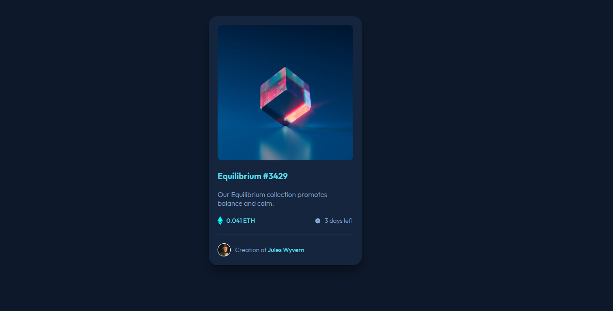
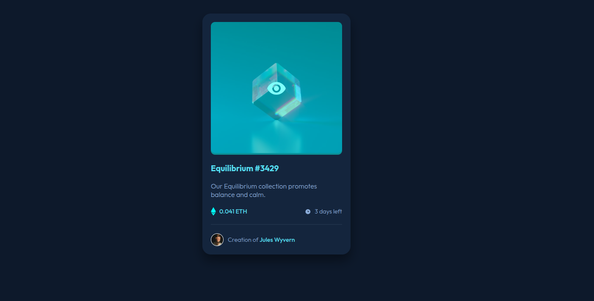

# Frontend Mentor - NFT preview card component solution

This is a solution to the [NFT preview card component challenge on Frontend Mentor](https://www.frontendmentor.io/challenges/nft-preview-card-component-SbdUL_w0U). Frontend Mentor challenges help you improve your coding skills by building realistic projects.

# Table of contents

- [Overview](#overview)
  - [The challenge](#the-challenge)
  - [Screenshot](#screenshot)
  - [Links](#links)
- [My process](#my-process)
  - [Built with](#built-with)
  - [What I learned](#what-i-learned)
  - [Author](#author)

## Overview

### The challenge

Users should be able to:

- View the optimal layout depending on their device's screen size
- See hover states for interactive elements

### Screenshot

Add a screenshot of your solution. The easiest way to do this is to use Firefox to view your project, right-click the page and select "Take a Screenshot". You can choose either a full-height screenshot or a cropped one based on how long the page is. If it's very long, it might be best to crop it.

### Links

- Solution URL: https://atharva150.github.io/Frontend-Mentor-3-column-preview-card-component/

### Built with

- Semantic HTML5 markup
- CSS custom properties
- Flexbox
- Responsive

### What I learned
I learned using Flexbox efficiently , How to use transitions .
I learned how to build responsive design .

I Still couldn't figure out why the border radius wont apply on the cars , so i just left it with the code .

This might not be the best solution I built , But I Will improve With Time and understand The process .

## Author
- Frontend Mentor - [@Atharva150](https://www.frontendmentor.io/profile/Atharva150yourusername)
- Twitter - [Atharva Kulkarni](https://x.com/Atharva64783515?t=y_GlXUv4JHLoD2XTEUYI5w&s=09)

